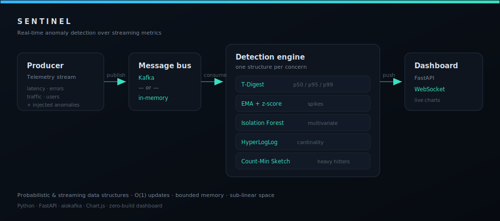

<div align="center">

# 🛰️ Sentinel

### Real-Time Anomaly Detection Engine

Stream telemetry through a battery of **probabilistic & streaming data structures** to detect
outliers, spikes, cardinality explosions and heavy hitters — live, in bounded memory.




</div>

---

## Why this project

Counting distinct users, tracking p99 latency, or finding the busiest endpoint **exactly** costs
memory proportional to the data — impossible on an unbounded stream. Sentinel does all of it in
**constant or sub-linear memory** using the classic probabilistic data structures that power real
observability systems (Datadog, Redis, Druid, BigQuery), and layers two complementary anomaly
detectors on top. Every structure is **implemented from scratch** (no `scikit-learn`, no
`datasketch`) so the algorithms are explicit and unit-tested for accuracy.

> **TL;DR** — A streaming-systems + DSA showcase: five hand-built algorithms, an async Kafka
> pipeline, and a live WebSocket dashboard. Runs with **zero setup** (`uvicorn app.main:app`) or
> against **real Kafka** (`docker compose up`).

---

## The data structures

Each structure owns exactly one concern. This is the heart of the project.

| Structure | What it answers | Why probabilistic | Complexity |
|---|---|---|---|
| **T-Digest** | "What's the p50 / p95 / p99 latency right now?" | Exact quantiles need all the data sorted; t-digest keeps tail-accurate percentiles in ~`compression` centroids | `add` O(1) amortised · `quantile` O(centroids) |
| **HyperLogLog** | "How many *distinct* users/IPs this window?" | Exact distinct-count is O(n) memory; HLL is ~0.8% error in **16 KB**, forever | `add` O(1) · `count` O(m) |
| **Count-Min Sketch** | "Which endpoint is a heavy hitter?" | A hash-table of counts is unbounded; CMS bounds error to `ε·N` in fixed space, one-sided | `add` / `estimate` O(depth) |
| **EMA + online variance** | "Is this value spiking vs its local trend?" | A moving average needs a window buffer; EMA needs **one number** and adapts to drift | O(1) time & memory |
| **Isolation Forest** | "Is the *joint* metric state an outlier?" | Catches anomalous *combinations* no single metric reveals, by random partitioning | `fit` O(t·ψ·logψ) · `score` O(t·logψ) |

### Division of labour

```
univariate spike  ──►  EMA z-score        (sharp, O(1), per-metric)
multivariate weird ──►  Isolation Forest   (joint outliers across latency × errors × traffic)
percentile breach ──►  T-Digest            (e.g. value above live p99)
diversity blowup  ──►  HyperLogLog         (unique-entity count spikes → scraping / botnet)
hot key           ──►  Count-Min Sketch    (one endpoint absorbs the traffic)
```

The EMA z-score is the sharp instrument for single-metric spikes; the Isolation Forest adds the
orthogonal ability to flag combinations that are individually plausible but never co-occur in
normal operation (e.g. *high latency + errors + a sudden traffic drop* = a degradation signature).

---

## What gets detected

The synthetic producer injects five anomaly archetypes; the engine catches each via a different
structure:

| Injected anomaly | Real-world analogue | Caught by |
|---|---|---|
| Latency spike (4–8×) | Slow dependency, GC pause | EMA z-score, T-Digest p99, hard threshold |
| Error-rate surge | Bad deploy, failing downstream | EMA z-score, hard threshold |
| Traffic surge / drop | Flash crowd, retry storm, outage | EMA z-score, Isolation Forest |
| Cardinality explosion | Scraping, botnet, credential stuffing | HyperLogLog |
| Endpoint hammering | Hot key, abusive client | Count-Min Sketch heavy hitter |

Measured false-positive rate on a clean stream: **~0.1%** (warmup + standardised multivariate
features keep the Isolation Forest from firing on normal tails).

---

## Quickstart

### Option A — zero setup (in-memory bus)

No broker, no Docker. The producer, bus, engine and dashboard run in one process.

```bash
python -m venv .venv
.venv/Scripts/activate            # Windows  (source .venv/bin/activate on macOS/Linux)
pip install -r requirements.txt
uvicorn app.main:app --port 8100
```

Open **http://localhost:8100** — the dashboard streams live within a couple of seconds.

### Option B — real Kafka pipeline (Docker)

Runs the producer and the detection API as **separate services** that talk only through Kafka,
demonstrating the true streaming topology.

```bash
docker compose up --build
```

Then open **http://localhost:8100**. Stop with `docker compose down -v`.

---

## The dashboard

A zero-build vanilla-JS + Chart.js dashboard, served by FastAPI and fed over a WebSocket:

- **Live charts** for latency, error rate and traffic, with anomaly points marked in red
- **T-Digest percentiles** (p50/p95/p99) and **EMA / z-score** per metric
- **HyperLogLog** unique-entity counter and **multivariate Isolation Forest** score gauge
- **Count-Min Sketch** top-endpoints bars (heavy hitters highlighted)
- **Live alert feed** with severity grading (low → critical) and detection provenance

<!-- Drop a screenshot at docs/dashboard.png and uncomment:

-->

---

## API

| Method | Path | Description |
|---|---|---|
| `GET` | `/` | The dashboard |
| `WS` | `/ws` | Live stream: snapshot on connect, then per-event analysis results |
| `GET` | `/api/health` | Liveness + active bus |
| `GET` | `/api/state` | Engine snapshot, latest result, config |
| `GET` | `/api/history?limit=N` | Recent metric history (for charts) |
| `GET` | `/api/alerts?limit=N` | Recent anomalies |

Interactive OpenAPI docs are auto-generated at **`/docs`**.

---

## Configuration

All settings are environment variables prefixed with `SENTINEL_` (see [`.env.example`](.env.example)):

```bash
SENTINEL_BUS=kafka                    # "memory" | "kafka"
SENTINEL_KAFKA_BOOTSTRAP_SERVERS=localhost:9092
SENTINEL_EMBEDDED_PRODUCER=false      # run scripts/run_producer.py separately
SENTINEL_PRODUCER_RATE_HZ=15
SENTINEL_ZSCORE_THRESHOLD=3.5
SENTINEL_IFOREST_THRESHOLD=0.68
SENTINEL_HEAVY_HITTER_THRESHOLD=0.45
```

Run a standalone producer against Kafka:

```bash
SENTINEL_BUS=kafka python -m scripts.run_producer --rate 20
```

---

## Testing

The data structures are verified for **accuracy**, not just "it runs" — HLL error bounds, CMS
one-sided error, T-Digest tail percentiles, Isolation Forest outlier separation, and end-to-end
engine detection.

```bash
pip install -r requirements-dev.txt
pytest                # 28 tests
```

---

## Project structure

```
app/
├── algorithms/          # the showcase — each hand-implemented + tested
│   ├── tdigest.py            streaming quantiles
│   ├── hyperloglog.py        cardinality estimation
│   ├── count_min_sketch.py   frequency / heavy hitters
│   ├── ema.py                EMA + online variance + z-score
│   └── isolation_forest.py   multivariate outlier scoring
├── detection/
│   ├── engine.py        wires the structures into anomaly verdicts
│   └── models.py        pydantic event / result schemas
├── streaming/
│   ├── bus.py           MessageBus: InMemoryBus | KafkaBus (aiokafka)
│   └── producer.py      synthetic telemetry + anomaly injection
├── static/              zero-build dashboard (HTML + CSS + JS)
└── main.py              FastAPI app: producer → bus → engine → WebSocket
scripts/run_producer.py  standalone Kafka producer
tests/                   28 accuracy & integration tests
```

---

## Tech stack

**Python 3.11+** · **FastAPI** (async API + WebSocket) · **aiokafka** (async Kafka) ·
**Pydantic v2** · **Chart.js** · **Docker Compose** (Kafka in KRaft mode, no Zookeeper).

## License

MIT — see [LICENSE](LICENSE).
